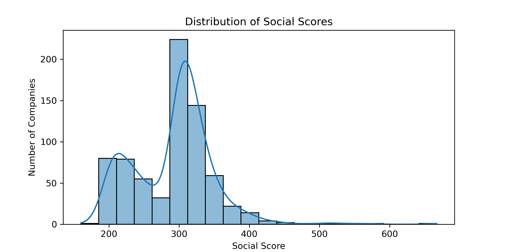

# ESG Score Discrepancy Analysis

This project investigates potential grade inflation in ESG (Enviromental, Social, Governance) - against their corresponding letter grades. Score-grade mismatches were analyzed, visualized, and exported for further inspection.

---

## Objectives

- Identify discrepancies between ESG scores and assigned grades
- Detect potential greenwashing by flagging inflated grades
- Group companies into ESG performance clusters
- Compare clusters to public grades to assess rating alignment

---

## Dataset

- [Global ESG Data (Kaggle)](https://www.kaggle.com/datasets/shivamshukla/explore-esg-environmental-social-and-governance)  
- File used: 'esg_scores.csv' (located in 'data/raw/')

---

## Methodology 

- Visualized ESG score distributions across catagories
- Used KMeans clustering on standardized ESG scores
- Calculated average score per grade and computed score-grade gaps
- Flagged companies with most negative 'total_gap' (score lower than grade suggets)
- Cross-referenced ESG clusters with total grade distribution

---

## Findings

- Companies in the **lowest-scoring ESG clusters** (Cluster 2) were sometimes assigned **BBB** grades - suggesting public grades may not reflect actual performance
- A-grade companies in the environment category were often **overrated**, scoring below their grade group average
- **BB and BBB grades** were often assigned to companies that performed **better than expected**, suggesting a compressed rating scale
- Several companies received **triple-B grades across all ESG dimensions** while scoring **at or near the minimum possible score**

---

## Key Visuals

**Total ESG Score Distribution**  

**Environmental Score Distribution**  

**Social Score Distribution**  

**Governance Score Distribution**  

**Environment Score by Grade**  

**Social Score by Grade**  

**Governance Score by Grade**  

**ESG Clusters (PCA)**  

**KMeans Elbow Plot**  

**Average Environment Score Gap by Grade**  

---

## Data Exports

- `data/processed/esg_discrepancy_flags.csv`: Score-grade deviation dataset  
- `data/processed/top_overrated_companies.csv`: Top 10 companies with largest negative total gaps  
- `data/processed/cluster_vs_grade_crosstab.csv`: ESG cluster vs total grade summary  

---

## Next Steps

- Develop an interactive dashboard to explore discrepancies  
- Add controversy or sentiment data for external triangulation  
- Perform time-series analysis (if available) to check rating trends over time  

---

## Author

**Brett Shaia**  
B.S. Computer Science  
M.S. Data Analytics (in progress)  
[GitHub](https://github.com/Bshaia)  
[Email](mailto:brettshaia@gmail.com)