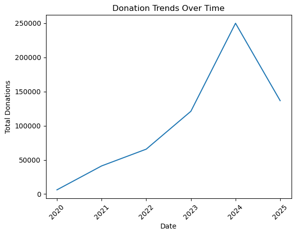
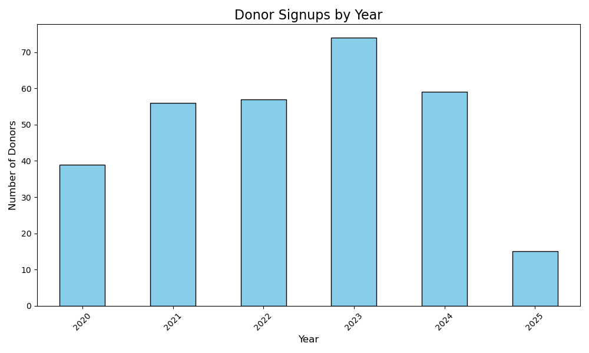
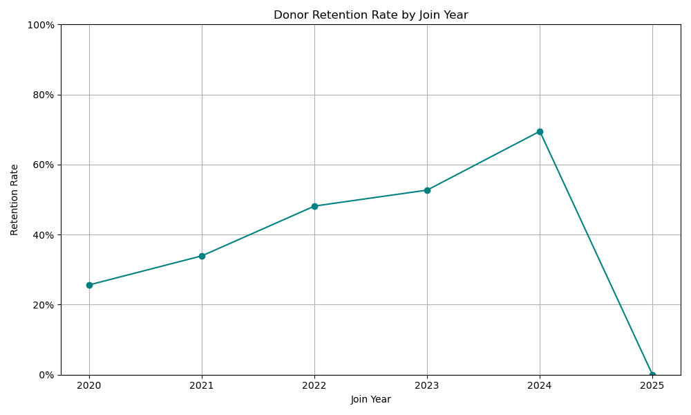
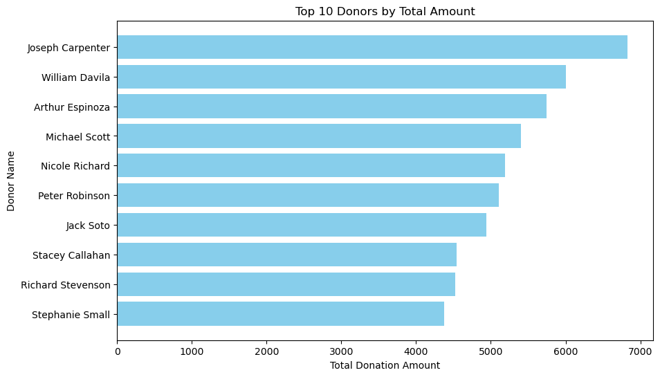

# Donor Retention Analysis

## Project Overview

This project analyzes donor behavior and retention using donation data, providing insights into donation trends, donor signups, retention by join year, and identifying top donors. The goals is to help organizations understand donation patterns, optimize engagement strategies, and identify high-value donors.

---

## Key Analysis Areas

- 1. Donation Trends:  
    Examies how donations have changed over the years.  
- 2. Donor Signups by Year:  
    Tracks the number of new donors each year.  
- 3. Donor Retention by Join Year:  
    Analyzes how many donors return in subsequent years.  
- 4. Top Donors: Identifies the most significant contributors to the organization.  

## Technologies Used

- Python: Primary language for data processing and analysis
- Pandas: Data manipulation and analysis
- Matplotlib: Data visualization for trends and insights.
- Git and Github: Version Control.

---

## Installation Requirements
Ensure you have Python 3.x installed along with the necessary libraries:    
```bash
pip install pandas matplotlib
```
### How to Run the Analysis
1. Clone the repository:  
```bash  
git clone https://github.com/Bshaia/data-analysis-portfolio.git
```
```bash
cd data-analysis-portfolio/nonprofit-impact-tracker
```
2. Run Jupyter Notebook to generate the analysis and visualization plots. 

---

## Visualizations 
Below are the visualizations generated from the analysis:

### 1. Donation Trends 
This chart displays overall donation trends over the years, showing the volume of donations for each year.


### 2. Donor Signups by Year
Tracks the number of new donor signups for each year, providing insights into donor acquistion trends.


### 3. Retention by Join Year
Visualizes the donor retention rate by the year they joined, showing trends in how well donors are retained over time. 


### 4. Top 10 Donors
Identifies the top 10 donors, offering insight into which individuals contribute the most to the organization.


---

## Findings

### 1. Donation Trends 
- There has been an overall increase in donations over the years, although growth has slowed in more recent years.
- The organization has seen some peaks in donation volumes that could correlate with specific events or campaigns.

### 2. Donor Signups
- The number of new donor signups has consistently increased, especially in recent years, showing a growing interest in the organization. 
- However, some of the new donors have lower retention rates, indicating the need for better engagement strategies.

### 3. Donor Retention 
- Retention rates vary significantly based on the join year. For instance, donors who joined in 2015 exhibit higher retention rates compared to those who joined in more recent years (e.g., 2019).
- This insight suggests that new donors may require more attention to ensure long-term retention.

### 4. Top Donors 
- A small group of top donors accounts for a disproportionately large percentage of the total donations. This highlights the potential to further engage and recognize high-value donors.
- Targeting these top donors for additional contribution or recognition could be a key strategy moving forward. 
